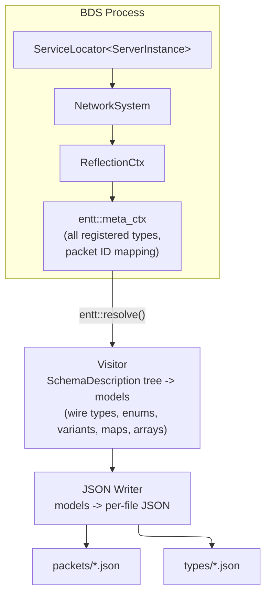
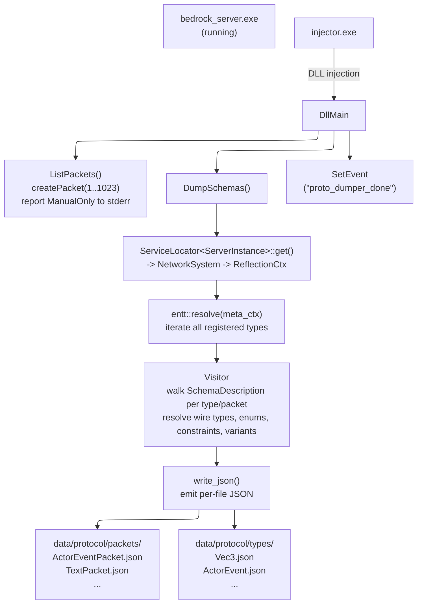

# proto-dumper

Extracts packet schemas from a running Bedrock Dedicated Server (BDS) via cereal reflection and generates JSON schema definitions.

## How It Works

BDS uses an in-house serialization library called **cereal** (not to be confused with the open-source cereal library) built on top of [EnTT](https://github.com/skypjack/entt)'s meta reflection system. Every packet payload type is registered with cereal at startup, creating a complete type graph with field names, types, constraints, enum values, and more.

This tool injects a DLL into the BDS process, walks that reflection data via `entt::resolve()`, and converts it to JSON schema files.

### Architecture



### Pipeline



## Output Format

The output uses a Kaitai-inspired JSON schema. Each field carries its wire encoding as a type string, with enums, arrays, and optionality as orthogonal modifiers.

### Packet

```json
{
  "id": 27,
  "name": "ActorEventPacket",
  "fields": [
    {
      "name": "mRuntimeId",
      "type": "varint64"
    },
    {
      "name": "mEventId",
      "type": "uvarint32",
      "enum": "ActorEvent"
    }
  ]
}
```

### Struct type

```json
{
  "name": "Vec3",
  "kind": "struct",
  "fields": [
    { "name": "x", "type": "float_le" },
    { "name": "y", "type": "float_le" },
    { "name": "z", "type": "float_le" }
  ]
}
```

### Enum type

```json
{
  "name": "ActorEvent",
  "kind": "enum",
  "values": [
    { "name": "NONE", "value": 0 },
    { "name": "JUMP", "value": 1 }
  ]
}
```

### Field modifiers

Fields can carry additional properties:

| Key | Meaning |
|-----|---------|
| `enum` | Overlay an enum on the wire type |
| `repeat` | Field is an array; value is the count prefix encoding (e.g. `"uvarint32"`) |
| `optional` | Field is `std::optional<...>` |
| `deprecated` | Marked deprecated in cereal |
| `description` | Help text from cereal |
| `constraints` | Min/max value, length, items, or pattern |

### Map field

```json
{
  "name": "Biomes",
  "type": { "key": "uint16_le", "value": "BiomeDefinitionData" },
  "repeat": "uvarint32"
}
```

### Tagged variant field

When a variant is discriminated by a sibling enum field:

```json
{
  "name": "Body",
  "type": {
    "switch": {
      "type": "varint32",
      "name": "Message Type",
      "enum": "TextPacketType"
    },
    "cases": ["MessageOnly", "AuthorAndMessage", "MessageAndParams"]
  }
}
```

### Untagged variant field

When a variant carries an inline discriminator index:

```json
{
  "name": "Rule Value",
  "type": {
    "switch": {
      "type": "uint8"
    },
    "cases": ["null", "bool", "int32_le", "float_le"]
  }
}
```

## Cereal Internals

### Type Registration

At BDS startup, every packet payload type calls `cerealizer<T>::bind(ctx)`:

```cpp
struct EmoteListPacketPayload {
    ActorRuntimeID mRuntimeId;
    std::vector<mce::UUID> mEmotePieceIds;
};

template<>
struct cerealizer<EmoteListPacketPayload> {
    static void bind(cereal::ReflectionCtx & ctx) {
        cereal::Factory<EmoteListPacketPayload> factory(
            ctx, "EmoteListPacketPayload", cereal::ReflectMode::Init);
        factory.bind<&EmoteListPacketPayload::mRuntimeId>("mRuntimeId")
               .bind<&EmoteListPacketPayload::mEmotePieceIds>("mEmotePieceIds");
    }
};
```

`bind<&T::mField>("name")` does the following:
1. Takes a pointer-to-member as a template parameter
2. Deduces the field type from the member pointer
3. Registers an `entt::meta_data` node with get/set function pointers
4. Stores field name, traits (required/optional/deprecated), and constraints
5. Recursively ensures the field's own type is also registered
6. Returns `Factory<T>&` for chaining

The Factory also supports:
- `.bindRequired<&T::mField>("name")` -- marks the field as required
- `.constraint(...)` -- adds min/max/pattern constraints
- `.deprecate("reason")` -- marks deprecated
- `.help("description")` -- adds field description
- `.serializationTraits(BigEndian)` -- per-field wire encoding hints

### Serialization Path

When a packet is sent, the write path is:

```
Packet::write(BinaryStream)
  -> PayloadSerializer::write<T>(packetId, ctx, payload, stream, mode)
       -> cerealWrite<T>(ctx, payload, stream)
            |
            +- BinarySchemaWriter writer(stream)    // wraps BinaryStream
            +- BasicSaver saver(ctx, config)        // orchestrator
            |
            +- saver.save<T>(writer, payload)
                 -> CompositeSchema<T>::doSave(writer, any)
                      // For each field registered via bind():
                      writer.pushMember("mRuntimeId")
                        TypeSchema<ActorRuntimeID>::doSave(writer, value)
                          writer.write(int64_t) -> stream.writeVarInt64()
                      writer.popMember()
```

`BinarySchemaWriter` translates abstract `write(int32_t)` calls into specific `BinaryStream` calls (`writeVarInt`, `writeSignedInt`, etc.) based on `SerializationTraits`.

The read path is the exact mirror using `BinarySchemaReader` and `BasicLoader`.

### Enum Wire Encoding

The C++ underlying type of an enum (e.g. `enum Foo : uint8_t`) does **not** determine how it is serialized on the wire. The wire format is controlled by `mSerializationTraits` (per-field) combined with `mUnderlyingType` (for signedness/size).

| `SerializationTraits` | Bits | Wire encoding |
|---|---|---|
| No `EnumAsValue` (0x00) | -- | **String** (the enum value name) |
| `EnumAsValue` (0x04) | bit 2 | Raw value, size based on underlying type (1 byte for Uint8, 2 for Uint16, etc.) |
| `EnumAsValue + Compression` (0x05) | bits 0+2 | **Varint** -- signed (`writeVarInt`) for Int types, unsigned (`writeUnsignedVarInt`) for Uint types |
| `EnumAsValue + BigEndian` (0x06) | bits 1+2 | **Fixed big-endian** (`writeInt` / `writeLong`) |

### Schema Description Extraction

`BasicSchema::description()` walks the same entt metadata but instead of reading/writing bytes, builds a `SchemaDescription` tree:

```cpp
SchemaDescription {
    .mType = Object,
    .mMembers = {
        "mRuntimeId": Member {
            .mType = Int64,
            .mRequired = false,
            .mDeprecated = false,
        },
        "mEmotePieceIds": Member {
            .mType = SequenceContainer,
            .mValueType = SchemaDescription { .mType = Object, ... },
        },
    }
}
```

This tree contains field names, types, constraints, full enum value tables, default values, and deprecation info -- everything needed to generate schema definitions.

### Serialization Modes

Each packet has a `SerializationMode`:

| Mode | Behavior |
|---|---|
| `ManualOnly` | Legacy hand-written `write(BinaryStream&)` only |
| `SideBySide_*` | Both manual and cereal, compare output for migration validation |
| `CerealOnly` | Pure cereal serialization |

BDS is actively migrating packets from manual to cereal. Since all packets have `cerealizer<T>::bind()` registrations regardless of mode, the reflection data is available for all of them.

### Field Ordering

Fields are serialized **in registration order** (the order `bind()` is called). The output preserves this order since it determines the wire layout.

## Building

Built with clang-cl + lld-link to stay ABI-compatible with BDS preview, which Mojang now ships built the same way.

```bash
# From a VS 2022 x64 Native Tools prompt (so clang-cl/lld-link and the MSVC STL are on PATH)
cmake --preset clang-cl-release
cmake --build --preset clang-cl-release
```

Swap `clang-cl-release` for `clang-cl-relwithdebinfo` to get a build with debug info.

Produces:
- `build/release/proto_dumper.dll` -- the injected DLL
- `build/release/injector.exe` -- the injector

## Usage

```bash
# Default: wait for bedrock_server.exe, inject proto_dumper.dll from same directory
injector.exe

# Custom process name
injector.exe -p my_server.exe

# Custom DLL path
injector.exe -d C:\path\to\proto_dumper.dll

# Timeout after 30 seconds waiting for process
injector.exe -t 30

# Wait up to 10 seconds for DLL to finish (default: 5)
injector.exe --dll-timeout 10
```

Output goes to `data/protocol/` relative to the host executable.

## Dependencies

| Library | Version | Purpose |
|---|---|---|
| [EnTT](https://github.com/skypjack/entt) | latest | Meta reflection (must match BDS's entt version for ABI compatibility) |
| [nlohmann/json](https://github.com/nlohmann/json) | v3.11.3 | JSON serialization |
| [argparse](https://github.com/p-ranav/argparse) | v3.2 | CLI argument parsing for injector |
| [libhat](https://github.com/BasedInc/libhat) | v0.9.0 | SIMD signature scanning |
| [expected-lite](https://github.com/nonstd-lite/expected-lite) | v0.10.0 | `nonstd::expected` error handling |

All fetched automatically via CMake FetchContent.
